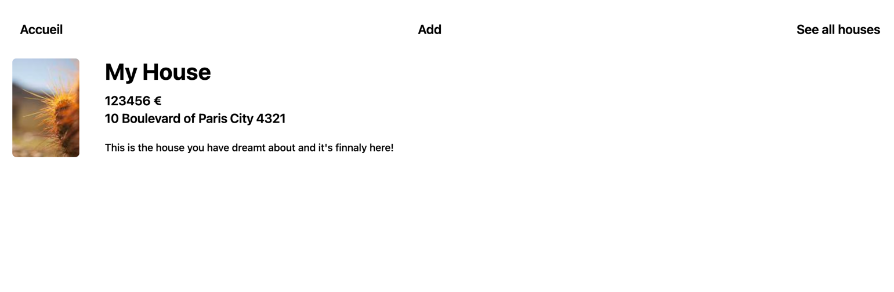

# HOUSE MANAGER

This is a small Spring project using postgresql as database and Thymeleaf as template engine.  

## Screenshots

### Home page

This is the page where all the houses are listed.

### House details page

This is where all the details of a house are listed.

### Add house form

The form to add a house.

### Management page

In this page you can manage the houses. Here you can delete and edit a house.
